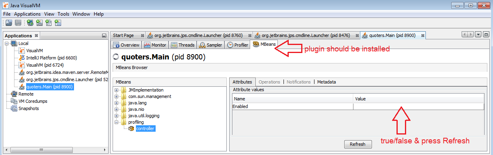

# SpringContexts

Launch jvisualvm.exe from your java/bin folder to change the value of 'Enabled' ProfilingController's field.
Install VisualVM-MBeans plugin and restart jvisualvm.exe. Run quoters.Main, change 'Enabled' attribute.

